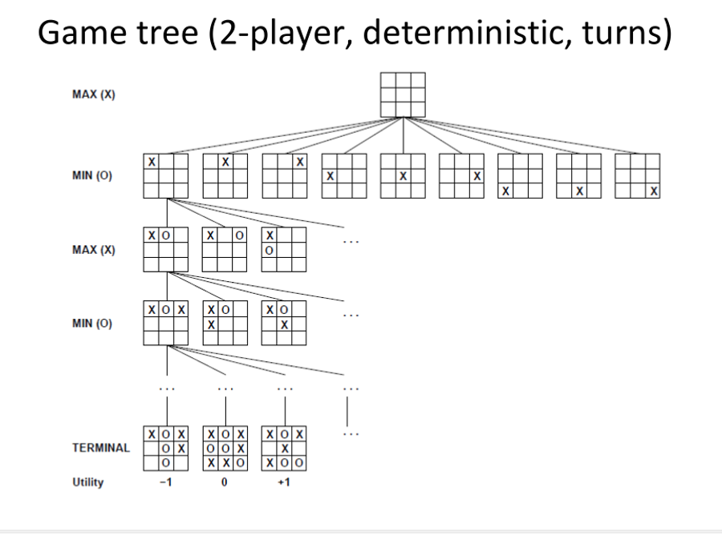
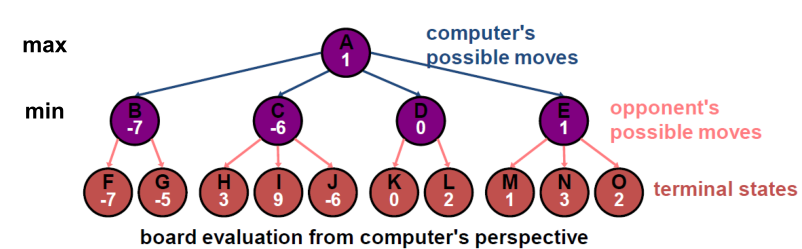
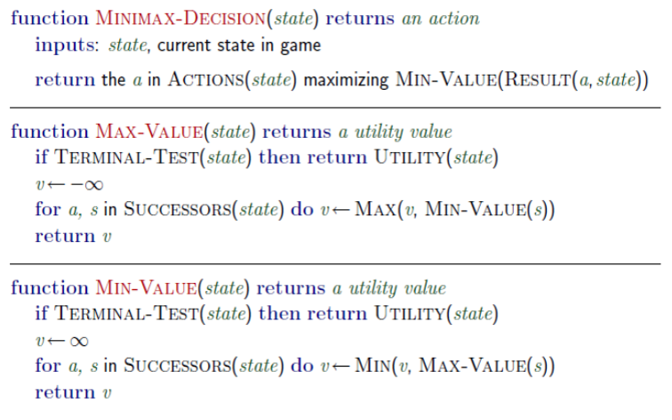
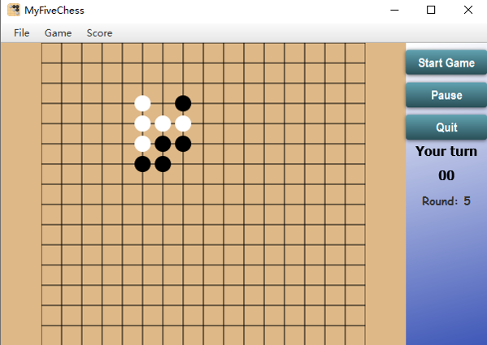
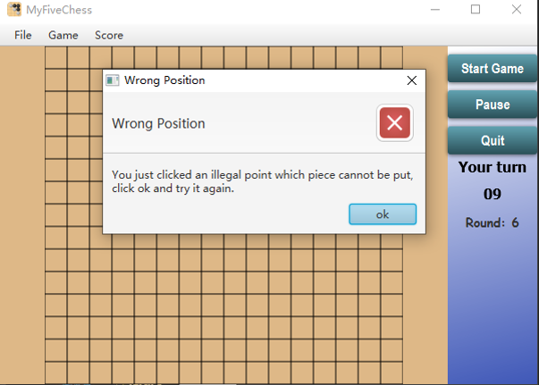
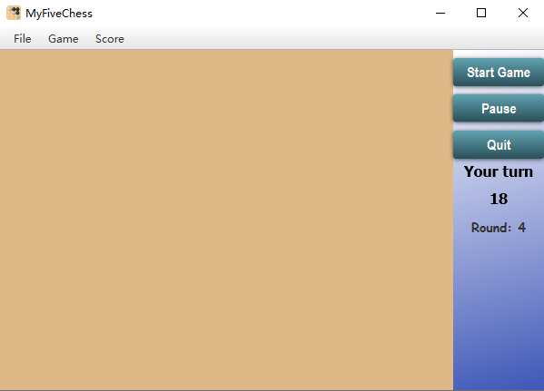

# 单机五子棋—— Java 实现

博弈搜索中的极小极大算法及其优化。这是我本科阶段实现的 Java 大作业，主要内容是实现一个可以与人博弈的五子棋 AI。

## 人机博弈

首先，要考虑以下三点：

- 机器如何像人一样观察棋局
  - 效用函数如何确定
  - 观察我方的哪些连子仍然有效
  - 观察对方的哪些连子具有威胁
- 机器如何做出比较好的决策
  - 机器如何行动
  - 如何比较两个不同行动的优劣
- 机器如何判断游戏已经终止
  - 机器如何判断输赢
  - 其他方面（平局、超时）

## 博弈树

这个五子棋小游戏的 AI 使用博弈树算法。如果将棋局中的每一步都看成一个状态，初始状态为空。那么落子的过程就是从一个状态跳转到另一个状态。可以让 AI 先预先遍历所有的状态，取一个对自己有利的一个路径走下去。

那么如何选择一个对自己有利的棋局呢？采用**极小极大值算法**！具体来说，如果 AI 可以给棋局上的每一个状态进行打分（基于自己棋子和对方棋子的分布情况），利于自己的连字可以给一个高分，而对方的连字会倒扣分数，那么就可以将问题转化为数学问题：

假设下棋的双方都是理性的，即轮流下棋时，轮到我方下子时，我会选择分数最高的状态；而对方会选择对我最不利的状态。其中一方要选取分数最大的状态，而另一方要选取最小的状态。当我们预先遍历所有可能发生的状态时（从博弈树角度看，就是遍历整个树），每次我都需要从对手给我选择的最差（min）局面中选出最好（max）的一个，才能保证我最大限度地赢得比赛。

使用函数互相递归调用实现该算法。在遍历整个博弈树后，最大值函数需要从所有最小的情况中取最大的，而最小值函数需要从所有最大的情况中取出最小的。

## 缺陷

算法需要遍历整颗博弈树，意味着时间空间复杂度是指数级的，因此在有限时间内只能对未来2-3回合进行预测。

在实现中，也遇到了一个非常奇怪的 bug。与 AI 下棋时，有时会出现程序突然卡死报错的情况 :sweat: 至今不知如何解决。

## 卖家秀

